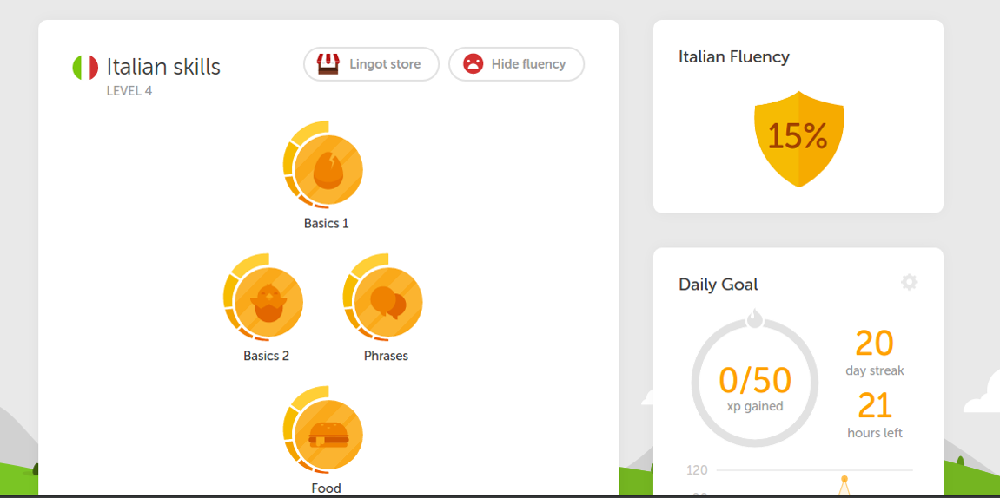
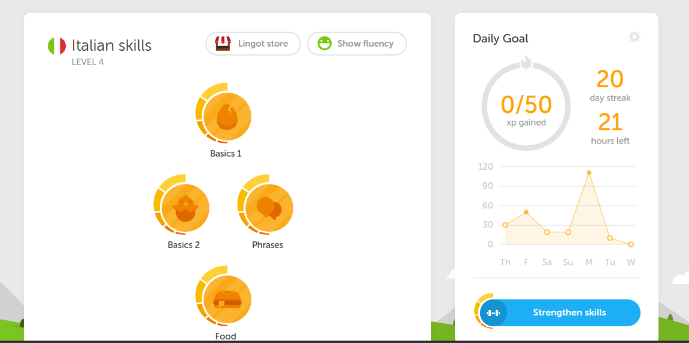
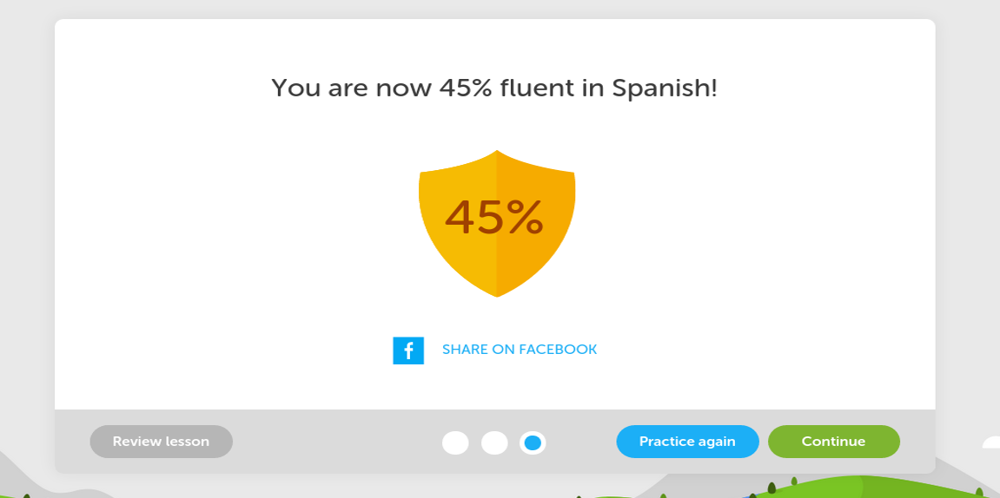

# Duolingo Toggle Fluency Percentage
Userscript for [Duolingo](https://www.duolingo.com/) that allows users to conveniently show/hide their fluency percentage.

### How To Install

1. Install the respective extension for your browser (may require browser restart):
 * Firefox: [Greasemonkey](https://addons.mozilla.org/en-US/firefox/addon/greasemonkey/)
 * Chrome/Chromium: [Tampermonkey](https://chrome.google.com/webstore/detail/tampermonkey/dhdgffkkebhmkfjojejmpbldmpobfkfo?hl=en)
 * Safari: [JavaScript Blocker](http://javascript-blocker.toggleable.com/)
 * Internet Explorer: Haha!
2. Get the userscript [here](https://raw.githubusercontent.com/alexstewartja/DuolingoToggleFluency/master/duolingo-togglefluency.user.js?duo).
3. When prompted, confirm installation.

<b>Please note that [cookies](http://en.wikipedia.org/wiki/HTTP_cookie) are uitlized for the script to function as expected. Clearing browser data may affect experience.</b>

### Usage

- On your Duolingo homepage, the toggle button will appear to the right of the "Lingot store" button.
- Use at will and enjoy the convenience.

### How To Uninstall
Follow the uninstall steps for the browser/extension you're using:
- Chrome/Chromium: [Tampermonkey](http://tampermonkey.net/faq.php?ext=dhdg#Q100)
- Firefox: [Greasemonkey](http://wiki.greasespot.net/Greasemonkey_Manual:Script_Management)
- Safari: [JavaScript Blocker](http://javascript-blocker.toggleable.com/)

### In Action

- When fluency is visible:

- When fluency is hidden:

- You will still receive updates after skill completions (the way it should be):

